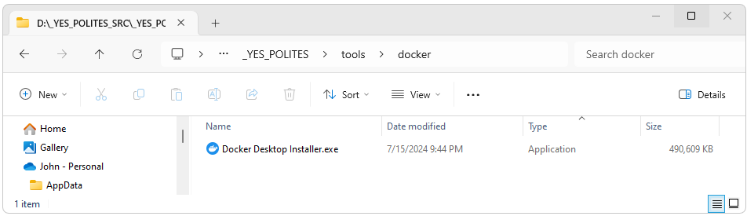
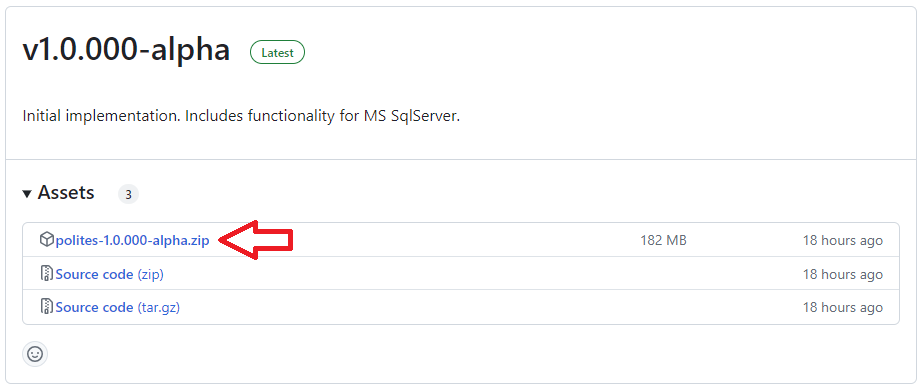
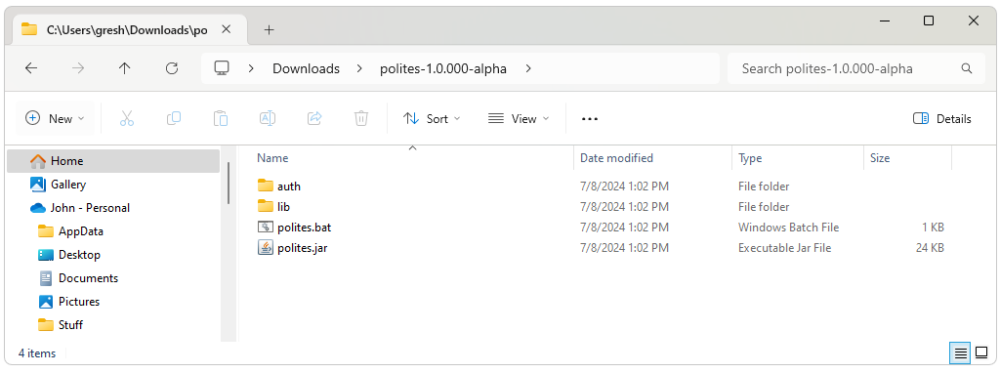

<!--
*
* Introduction
*
-->

<h2>Introduction</h2>

  Polites1 is a Java based tool that enables the automation of complete OHDSI implementations for either standalone (non-Docker) or Broadsea2 based OHDSI deployments.  Broadsea provides a turn-key solution with unparalleled ease of use and a standardized stable production deployment that includes an instance of a Common Data Model replete with test data in PostgreSql.  “Broadsea 3.0 provides a flexible approach to deploying OHDSI tools that are typically challenging to set up, and establishes a framework for supporting new OHDSI tools to come.  Any site, regardless of size, can deploy a wide range of OHDSI tools on a laptop or a production server”3 using Broadsea.  However, after initial deployment there are customizations that most implementations will want to make to create a production, test, or development instance of an OHDSI implementation.  This includes the creation of an independent instance of the CDM that could be in the existing Broadsea instance of PostgreSql or in any of the other data management systems supported by OHDSI (including Oracle, Microsoft Sql Server, PostgreSql, Databricks, etc.).  Creation of this environment entails numerous steps that need to integrated and executed flawlessly.  This process can be time consuming and fraught with errors and includes the creation of multiple databases and/or schemas and other database objects, creation of multiple users with detailed specific privileges, the creation of meta data such as the CDM source record and webapi records, the importing of vocabulary data, the creation of sequences for primary keys for ETL processes, the creation of indexes and constraints, the importing of data, and the running of other processes such as Achilles.  Polites provides a way to execute all of these processes and an interface that allows the processes to be selected individually or run in groups.  
  <ol>
    <li>
      Polites GitHub repository.  https://github.com/NACHC-CAD/polites. 
    </li>
    <li>
      Broadsea GitHub repository. https://github.com/OHDSI/Broadsea. 
    </li>
    <li>
      Ajit Londhe, Lee Evans, Sanjay Udoshi, Broadsea 3.0: “BROADening the ohdSEA”, https://www.ohdsi.org/wp-content/uploads/2023/10/Londhe-Ajit_Broadsea-3.0-BROADening-the-ohdSEA_2023symposium-Ajit-Londhe.pdf. 
    </li>
  </ol>

<!--
*
* Installation Overview
*
-->

<h2>Prerequisites</h2>

<h3>Prerequisites Overview</h3>

  Installing and running Polites consists of the following steps. 
  These steps can be done manually or can be done using the Yes installer 
  described in the Automated Installation of Prerequisiets section below. 
  <ul>
    <li>
      Install the dependencies for Polites and Broadsea. 
      These include the following:
        <ul>
          <li>
            Java version 8 and 11
          </li>
          <li>
            A git client
          </li>
          <li>
            R and RStudio
          </li>
          <li>
            Microsoft SqlServer
          </li>
          <li>
            Docker
          </li>
        </ul>
    </li>
    <li>
      Install, Configure and Run Broadsea
    </li>
    <li>
      Install and Configure Polites
    </li>
    <li>
      Run Polites
    </li>
  </ul>

<!--
*
* Automated Installation of Prerequisites
*
-->

<!-- Prerequisites Installation -->
<h3>Prerequisites Installation</h3>

<!-- Run the YesPolitesInstaller -->
<h4>Run the YesPolitesInstaller</h4>
All of the prerequisites for Broadsea and Polites can be installed using the YesPolitesInstaller. 
Download the 
<a href="https://www.dropbox.com/s/wguc4w6okycpm4x/YesPolitesInstaller-1.0.019.exe?dl=1">
  YesPolitesInstaller.exe
</a> file and run it. 
Downloading and running this file does take a few minutes. 
The installer creates a directory called _YES_POLITES that contains resources needed for Broadsea and other OHDSI tools 
and also installs and configures other required resources. 
Overall, the installer does the following: 

<ul>
  <li>
    Installs a git client that will be used to download and install Broadsea and other resources. 
    (the installation will also configure the certificates used by this client) 
  </li>

  <li>
    Installs Java 8 and Java 11
  </li>

  <li>
    Installs a number of .bat files including the following:
    <ul>
      <li>jv: Changes the Java version to 8 or 11</li>
      <li>git-detials: gives the git information about the current repository
    </ul>
  </li>

  <li>
    Downloads a copy of the installer for Docker 
    (this insures that all instances of Polites are using the same version of Docker). 
  </li>

  <li>
    Downloads installers for the databases supported by polites
  </li>

  <li>
    Installs the correct version of R
  </li>

  <li>
    Downloads installers for RStudio and RTools
  </li>

  <li>
    Installs database specific dependencies 
    (e.g. installs and configures the JDBC DLL required by Sql Server and updates environment variables to point to the correct version of this DLL)
  </li>

  <li>
    Updates the system environment variables to put required tools on the system path
  </li>
</ul>

<!-- Install Docker -->
<h4>Install Docker</h4>
Navigate to C:\\_YES_POLITES\\tools\\docker and run the Docker Desktop Installer.exe file. 
Accept all of the default values. 
 

 

<!-- Install Broadsea -->
<h4>Install Broadsea</h4>
Broadsea can be installed and configured by running the C:\\_YES_POLITES\\workspace\\install-broadsea.bat file. 
This process will install Broadsea v3.0.0 and update the configuration for the current installation. 
This process also puts the following .bat files in the Broadsea directory. 
These .bat files can be used to manage Broadsea. 
<ul>
  <li>
    start.bat 
    This script will start Broadsea
  </li>
  <li>
    stop.bat 
    This script will stop Broadsea
  </li>
  <li>
    clean-docker.sh 
    This script will delete all images, containers, and volumes from Docker
  </li>
  <li>
    reset.bat 
    This script will clear Docker of all images, containers, and volumes 
    but will preserve the data stored in the Postgres database used by Broadsea
  </li>
  <li>
    show-docker.bat 
    This script will show the images, containers, and volumes that exist in Docker
  </li>
</ul>

<!-- Start Broadsea -->
<h4>Start Broadsea</h4>
Before running Broadsea you will need to start Docker Desktop 
(there should be a shortcut on your desktop from the initial installation). 
To run Broadsea, open a cmd prompt, navigate to C:\\_YES_POLITES\\workspace\\Broadsea 
and then execute the start.bat script. 

<h2>Platform Details</h2>

Support for Microsoft Sql Server, PostgreSql, and Databricks is targeted for the completion of the first relase of Polites. 
This release of Polites currently supports Microsoft Sql Server.  
Processes specific to the installation for each platform are given in the pages listed below. 
Execute the process for the platform you are targeting. 
  <ul>
    <li>
      <a href="./sqlserver.html">Microsoft SqlServer</a>
    </li>
    <li style="color: gray;">
      PostgreSql (coming soon)
    </li>
    <li style="color: gray;">
      Databricks (coming soon)
    </li>
  </ul>

<!--
*
* Polites Installation
*
-->

<h2>Polites Installation</h2>

  Polites is installed by Downloading the zip file from the latest release, 
  Unziping the files, and then running the polites.bat file 
  (which runs "java -jar polites.jar" with some additional performance parameters). 
  Releases of Polites can be found at 
  <a href="https://github.com/NACHC-CAD/polites/releases">https://github.com/NACHC-CAD/polites/releases</a>.
   
  

  After downloading and extracting the zip file you should see the following files. 
   
  
   
  The auth folder contains two files: app.properties and sqlserver-demo-app.properties. 
  The sqlserver-demo-app.properties file contains and example configuration for Microsoft SqlServer 
  that should work out of the box. The app.properties file contains a single line 
  that points to the actual configuration file. This alows the configuration file 
  and any sensitive information this file might contain such as passwords to exist 
  anywhere that is accessible by the file system. 

<!--
*
* Polites Configuration
*
-->

<h2>Polites Configuration</h2>

  All configuration for the Polites application is in a single configuration file. 
  This configureation file is pointed to by the ./auth/app.properties file as shown below. 
  Note the path to the configuration file can be on the class path 
  or can be an absolute reference (e.g. C:\\path\\to\\myfile.properties). 
  The downloaded zip file contains an exmple configuration for a Microsoft SqlServer implementation 
  that should work out of the box. 
  Modify this file to fit your specific implementation. 

<!-- app.properties -->

  app.properties contents:

<!--
*
* app.properties preformated section
*
-->

<pre class="pre-scrollable">
/auth/sqlserver-demo-app.properties
</pre>

<!-- sqlserver-demo-app.properties -->

  sqlserver-demo-app.properties contents:
  
<!--
*
* sqlserver-demo-app.properties preformated section
*
-->

<pre class="pre-scrollable">
# ---
#
# Example properties file for Polites using Microsoft Sql Server.  
#
# ---

# ---
# GLOBAL PARAMETERS
# ---

DbmsName=sql server
CdmVersion=5.4
ExportDir=C:\\temp\\polites\\export\\sql-server\\synthe_omop

# ---
# DATABASE CONNECTION INFORMATION FOR THE CDM INSTANCE
# The bootstrapUrl parameter is used for system level actions like creating new databases
# The url parameter is used to access the CDM instance and other local databases (e.g. achilles data)
# ---

BootstrapUrl=jdbc:sqlserver://localhost;databaseName=master;integratedSecurity=true;encrypt=false
Url=jdbc:sqlserver://localhost:1433;encrypt=false;TrustServerCertificate=True
Uid=polites_omop
Pwd=Sneaker01
ServerName=localhost
Port=1433
FullySpecifiedCdmSchemaName=polites_omop.dbo

# ---
# DATABASE DRIVER
# ---

DatabaseDriverName=sqlServer_12_6
DatabaseDrvierPath=C:\\temp\\polites\\drivers\\sqlserver

# ---
# POSTGRES CONNECTION 
# Connection parameters to connect to the PostgreSql instance hosting the webapi schema.
# ---

# bootstrap connection for atlas postgres
PostgresBootstrapUrl=jdbc:postgresql://127.0.0.1:5432
PostgresBootstrapUid=postgres
PostgresBootstrapPwd=mypass
PostgresServer=127.0.0.1/postgres
PostgresPort=5432
PostgresWebApiDatabaseName=postgres
PostgresWebApiSchemaName=webapi
PostgresPathToDriver=C:\\temp\\polites\\drivers\\postgres\\42.3.3

# ---
# VALUES USED TO CREATE CDM_SOURCE RECORD
# These values are used by the Data Quality Dashboard. Documented here:
#   https://nachc-cad.github.io/fhir-to-omop/pages/navbar/ohdsi-tools/dqd/DataQualityDashboard.html
#   https://ohdsi.github.io/DataQualityDashboard/ 
# ---

CdmSourceName=NACHC Test
CdmSourceAbbreviation=NACHC-TEST
CdmHolder=johngresh@curlewconsulting.com
SourceDescription=Test database
SourceDocumentationReference=https://github.com/NACHC-CAD/fhir-to-omop
CdmEtlReference=N/A 
SourceReleaseDate=2021-12-01
CdmReleaseDate=2021-12-01
VocabularyVersion=v5.0 04-FEB-22
CdmVersionConceptId=756265

# ---
# TERMINOLOGY
# ---
TerminologyRootDir=C:\\temp\\polites\\default-vocabulary\\
TerminologyDownloadIfNotFound=true
TerminologyDownloadUrl=https://www.dropbox.com/s/2f1xg20yjbiup27/2023-01-01-vocabulary_download_v5_%7Bd496576d-0027-4564-b598-491e7f1ac26f%7D_1672620434076.zip?st=lnn6zg75&dl=1

# ---
# WEBAPI
# ---

# parameters for webapi source and source_daimon records
AtlasDataSourceName=Eunomia Loaded From Polites
AtlasDataSourceKey=polites_omop
AchillesResultsDatabase=polites_omop_ach_res
AchillesResultsSchema=dbo
AchillesTempDatabase=polites_omop_ach_temp
AchillesTempSchema=dbo
AchillesVocabDatabase=polites_omop
AchillesVocabSchema=dbo
AtlasCdmUrl=jdbc:sqlserver://host.docker.internal:1433;databaseName=polites_omop;encrypt=false;TrustServerCertificate=True;user=polites_omop;password=Sneaker01

# ---
# CDM CSV
# ---

CdmCsvZipFileLocation=C:\\temp\\polites\\cdm-csv\\
CdmCsvZipFileName=demodb.zip
CdmCsvDownloadUrl=https://www.dropbox.com/scl/fi/87p8c1oyvzmvsfei15z1m/demodb.zip?rlkey=x2libh0dmk06bnc4m6fu81iho&dl=1
CdmCsvDownloadIfNotFound=true

# ---
# DQD: Instance where Data Quality Dashboard data will be stored
# ---

DqdResultsSchemaName=polites_omop_dqd

# ---
# SYNTHEA CSV
# ---

# booleans to use defaults if resources are not found
SyntheaCsvDownloadTestFilesIfNotFound=false
SyntheaCsvDownloadJdbcDriverIfNotFound=true
# locations for test files
SyntheaCsvTestFilesUrl=https://www.dropbox.com/scl/fi/zkh0k485yq9joqhxo5cws/csv.zip?rlkey=8afasqdy7h2hnudir1ieid2pw&dl=1
SyntheaCsvFilesDir=C:\\temp\\polites\\synthea-csv\\csv
SyntheaCsvJdbcLocation=C:\\temp\\polites\\drivers\\sqlserver
SyntheaCsvJdbcDriverName=mssql-jdbc-12.6.2.jre11.jar
SyntheaCsvJdbcDownloadUrl=https://www.dropbox.com/scl/fi/qyd8o6taim9q7ui52ftae/mssql-jdbc-12.6.2.jre11.jar?rlkey=kpo4w8n6uf21bj8ojfbc4k71k&st=2atiqqv7&dl=1
# connection parameters
SyntehsCsvUid=polites_omop
SyntheaCsvPwd=Sneaker01
JdbcExtraSettings=encrypt=false;trustServerCertificate=true;databaseName=synthea_native_csv
# database schema for raw data file upload
SyntheaCsvNativeSchema=synthea_native_csv.dbo
SyntheaCsvNativeDatabase=synthea_native_csv
# synthea version
SyntheaVersion=3.2.0

</pre>

<!--
*
* Basic Functionality
*
-->

<h2>Basic Functionality</h2>

  Polites currently supports the functionality described below. 

  

  <!-- 
  *
  * Reset
  *
  * -->

  <h3>Reset</h3>

  <h4>Burn Everything to the Ground</h4>
  Burn Everything to the Ground is the reset option. 
  This option will remove everything created by Polites 
  including all databases and users. 
  
  <!-- 
  *
  * Create Database Objects
  *
  * -->

  <h3>Create Database Objects</h3>

  <h4>Create Database</h4>
  This option creates the database that will be used for the Common Data Model (CDM).
  
  <h4>Create Database Users</h4>
  This creates the database users that will be used to access the CDM 
  and other databases such as the databases created by Achilles and other processes. 
  The users created by this option are granted all of the privileges required. 
  
  <h4>Create Tables</h4>
  This creates the tables in the CDM database using the ddl scripts from the OHDSI CDM project in Github. 
  
  <h4>Create CDM Source Record</h4>
  This creates the record required in the cdm_source table of the CDM. 
  
  <h4><nobr>Create Dummy Records</nobr></h4>
  The "Create Dummy Location and Care Site Records" option truncates the location and care_site tables 
  and then adds a single record in each table representing an unknown value 
  (this is used in place of null for referential integrity). 
  
  <!-- 
  *
  * Terminology
  *
  * -->

  <h3>Terminology</h3>
  
  <h4>Truncate Terminology</h4>
  This option truncates all of the terminology tables. 
  The following are considered to be terminology tables. 
  All other tables are considered to be data tables. 
  <ul>
    <li>CONCEPT</li>
    <li>VOCABULARY</li>
    <li>DOMAIN</li>
    <li>CONCEPT_CLASS</li>
    <li>CONCEPT_RELATIONSHIP</li>
    <li>RELATIONSHIP</li>
    <li>CONCEPT_SYNONYM</li>
    <li>CONCEPT_ANCESTOR</li>
    <li>DRUG_STRENGTH</li>
  </ul>

  <h4>Load Terminology</h4>  
  The "Load Terminology (From Athena Files)" option loads a directory of files 
  that was downloaded and unzipped from 
  <a href="https://athena.ohdsi.org/">Athena</a>.
  
  <h4>Import Terminology</h4>
  The "Import Terminology (From an Exported Zip File)" option imports terminology tables 
  from a zip file created using the "Export Terminology" option described directly below. 
  This option will also load only the terminology tables from a complete export 
  that was created using the "Export All CDM Tables" option of this application described below. 
  
  <h4>Export Terminology</h4>
  This option creates a zip file that contains the terminology table as csv files. 
  This export can be imported using the " (From an Exported Zip File)" option 
  of this tool described directly above. 
  
  <!-- 
  *
  * Truncate/Import/Export (data only)
  *
  * -->

  <h3><nobr>Truncate/Import/Export (data only)</nobr></h3>
  
  <h4>Truncate Data Tables</h4>
  The "Truncate (Data Tables Only)" option truncates all of the data tables 
  (but not the terminology tables) so a new data set can be imported into the database. 
  
  <h4>Import Data Tables</h4>
  The "Import (Data Tables Only)" option imports data tables from a zip file 
  created using the "Export (Data Tables Only)" option of this tool. 
  This option will also import only the data tables from a zip file created 
  using the "Export All CDM Tables" option of this application. 
  
  <h4>Export Data Tables</h4>
  The "Export (Data Tables Only)" option creates a zip file that contains CSV files 
  that represent all of the data tables (and not the terminology tables). 
  This zip file can be used by the "Import (Data Tables Only)" option of this tool described directly above. 

  <!-- 
  *
  * Truncate/Import/Export (all)
  *
  * -->

  <h3><nobr>Truncate/Import/Export (all)</nobr></h3>
  
  <h4>Truncate All Tables</h4>
  The "Truncate All CDM Tables" option truncates all of the CDM tables 
  (including all data and terminology tables). 
  
  <h4>Import All Tables</h4>
  The "Import All CDM Tables" option imports data tables from a zip file 
  created using the "Export All CDM Tables" option of this tool. 
  This option will also import all tables in other zip files created by this application 
  (e.g. Export Data Tables only and Export Terminology Tables Only). 
  
  <h4>Export All Tables</h4>
  The "Export All CDM Tables" option creates a zip file that contains CSV files 
  that represent all of the tables in the CDM including both data and terminology tables. 
  This zip file can be used by the "Import All CDM Tables" option of this tool described directly above. 

  <!-- 
  *
  * Synthea
  *
  * -->

  <h3>Synthea</h3>

  <h4>Load Synthea CSV</h4>
  The "Load Synthea CSV Files" option loads files created by 
  <a href="https://github.com/synthetichealth/synthea">Synthea</a> using the 
  <a href="https://github.com/OHDSI/ETL-Synthea">OHDSI ETL-Synthea</A> R scripts. 
  The Synthea files are loaded into a separate schema 
  and then an ETL process is run to populate the OHDSI/OMOP CDM database. 
  
  <!-- 
  *
  * Sequences/Indexes/Constraints
  *
  * -->

  <h3>Sequences/Indexes/Constraints</h3>

  <h4>Create Sequences</h4>
  The "Create Sequences for Primary Keys" option generates a series of sequences 
  that can be used to manage primary keys when records are created. 
  This option is primarily used in association with the creation of new records using FHIR resources. 

  <h4>Create Indexes</h4>
  This option creates the indexes for the CDM using the ddl scripts from the CDM project. 
  This script is generally run after data are loaded and before Achilles is run. 
  
  <h4>Add Constraints</h4>
  This option creates the constraints for the CDM using the ddl scripts from the CDM project. 
  This script is generally run after data are loaded and before Achilles is run. 
  
  <h4>Disable Constraints</h4>
  This option disables all constraints for the CDM. 
  This does not included constraints that are integral to the table such as not null stipulations. 
  This option is often run prior to truncating and replacing the data and or terminology tables. 
  
  <h4>Enable Constraints</h4>
  This option turns the constraints for the CDM back on if they have been turned off. 

  <!-- 
  *
  * Run Achilles
  *
  * -->

  <h3>Run Achilles</h3>
  
  <h4>Delete WebAPI Records</h4>
  This option deletes the source and source_daimon records in the webapi schema 
  that is generally maintained in PostgreSql. 
  
  <h4>Add WebAPI Records</h4>
  This option will add the webapi source and source_daimon records 
  defined in the properties file used by this application. 
  These records are required prior to running Achilles or Atlas. 
  
  <h4>Create Achilles Database</h4>
  This option creates the Achilles database and configures all security options 
  to allow existing database users used by this application and Achilles/Atlas, etc. access. 

  <h4>Run Achilles</h4>
  This option runs Achilles using a SQL script generated by Achilles using the SQL only option of that application. 
  More information on Achilles is available at the github site for 
  <a href="https://github.com/OHDSI/Achilles">Achilles</a>.

<h2>Huzzah!</h2>
After using the above functionality to create and populate your OHDSI Instance 
you are now ready to start using the OHDSI tools to view and manipulate your data. 
<h3>Atlas</h3>
With Broadsea running, you should now be able to launch Atlas by opening a browser 
and navigating to <a href="http://127.0.0.1/atlas">http://127.0.0.1/atlas</a>. 

