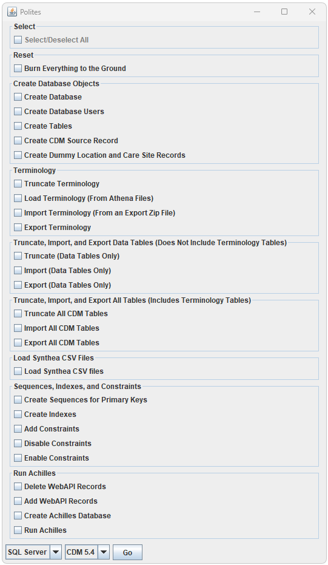

<!--
*
* Quick Links
*
-->

<h2>Quick Links</h2>

  Polites is targeted to support Microsoft SqlServer, PostgreSql, and Databricks 
  when the initial release is completed. 
  Below are links to the specific documentation for each platform. 
  <ul>
    <li>
      <a href="./sqlserver.html">Microsoft SqlServer</a>
    </li>
    <li style="color: gray;">
      PostgreSql (coming soon)
    </li>
    <li style="color: gray;">
      Databricks (coming soon)
    </li>
  </ul>

<!--
*
* Introduction
*
-->

<h2>Introduction</h2>

  Polites1 is a Java based tool that enables the automation of complete OHDSI implementations for either standalone (non-Docker) or Broadsea2 based OHDSI deployments.  Broadsea provides a turn-key solution with unparalleled ease of use and a standardized stable production deployment that includes an instance of a Common Data Model replete with test data in PostgreSql.  “Broadsea 3.0 provides a flexible approach to deploying OHDSI tools that are typically challenging to set up, and establishes a framework for supporting new OHDSI tools to come.  Any site, regardless of size, can deploy a wide range of OHDSI tools on a laptop or a production server”3 using Broadsea.  However, after initial deployment there are customizations that most implementations will want to make to create a production, test, or development instance of an OHDSI implementation.  This includes the creation of an independent instance of the CDM that could be in the existing Broadsea instance of PostgreSql or in any of the other data management systems supported by OHDSI (including Oracle, Microsoft Sql Server, PostgreSql, Databricks, etc.).  Creation of this environment entails numerous steps that need to integrated and executed flawlessly.  This process can be time consuming and fraught with errors and includes the creation of multiple databases and/or schemas and other database objects, creation of multiple users with detailed specific privileges, the creation of meta data such as the CDM source record and webapi records, the importing of vocabulary data, the creation of sequences for primary keys for ETL processes, the creation of indexes and constraints, the importing of data, and the running of other processes such as Achilles.  Polites provides a way to execute all of these processes and an interface that allows the processes to be selected individually or run in groups.  
  <ol>
    <li>
      Polites GitHub repository.  https://github.com/NACHC-CAD/polites. 
    </li>
    <li>
      Broadsea GitHub repository. https://github.com/OHDSI/Broadsea. 
    </li>
    <li>
      Ajit Londhe, Lee Evans, Sanjay Udoshi, Broadsea 3.0: “BROADening the ohdSEA”, https://www.ohdsi.org/wp-content/uploads/2023/10/Londhe-Ajit_Broadsea-3.0-BROADening-the-ohdSEA_2023symposium-Ajit-Londhe.pdf. 
    </li>
  </ol>

<!--
*
* Installation Overview
*
-->

<h2>Installation Overview</h2>

  Installing and running Polites consists of the following steps. 
  These steps are described in more detail in the linked pages 
  and in the pages specific to each database (e.g. SqlServer, PostgreSql, and Databricks). 
  <ul>
    <li>
      Install the dependencies for Polites and Broadsea. 
      These include the following:
        <ul>
          <li>
            Java version 8 and 11
          </li>
          <li>
            A git client
          </li>
          <li>
            R and RStudio
          </li>
          <li>
            Microsoft SqlServer
          </li>
          <li>
            Docker
          </li>
        </ul>
    </li>
    <li>
      Install, Configure and Run Broadsea
    </li>
    <li>
      Install and Configure Polites
    </li>
    <li>
      Run Polites
    </li>
  </ul>

  Polites is installed by Downloading the zip file from the latest release, 
  Unziping the files, and then running the polites.bat file 
  (which runs "java -jar polites.jar" with some additional performance parameters). 
  Releases of Polites can be found at 
  <a href="https://github.com/NACHC-CAD/polites/releases">https://github.com/NACHC-CAD/polites/releases</a>.
   
  

  After downloading and extracting the zip file you should see the following files. 
   
  
   
  The auth folder contains two files: app.properties and sqlserver-demo-app.properties. 
  The sqlserver-demo-app.properties file contains and example configuration for Microsoft SqlServer 
  that should work out of the box. The app.properties file contains a single line 
  that points to the actual configuration file. This alows the configuration file 
  and any sensitive information this file might contain such as passwords to exist 
  anywhere that is accessible by the file system. 

<!--
*
* Configuration
*
-->

<h2>Configuration</h2>

  All configuration for the Polites application is in a single configuration file. 
  This configureation file is pointed to by the ./auth/app.properties file as shown below. 
  Note the path to the configuration file can be on the class path 
  or can be an absolute reference (e.g. C:\\path\\to\\myfile.properties). 
  The downloaded zip file contains an exmple configuration for a Microsoft SqlServer implementation 
  that should work out of the box. 
  Modify this file to fit your specific implementation. 

<!-- app.properties -->

  app.properties contents:
<pre class="pre-scrollable">
/auth/sqlserver-demo-app.properties
</pre>

<!-- app.properties -->

  sqlserver-demo-app.properties contents:
<pre class="pre-scrollable">
# ---
#
# Example properties file for Polites using Microsoft Sql Server.  
#
# ---

# ---
# GLOBAL PARAMETERS
# ---

DbmsName=sql server
CdmVersion=5.4
ExportDir=C:\\temp\\polites\\export\\sql-server\\synthe_omop

# ---
# DATABASE CONNECTION INFORMATION FOR THE CDM INSTANCE
# The bootstrapUrl parameter is used for system level actions like creating new databases
# The url parameter is used to access the CDM instance and other local databases (e.g. achilles data)
# ---

BootstrapUrl=jdbc:sqlserver://localhost;databaseName=master;integratedSecurity=true;encrypt=false
Url=jdbc:sqlserver://localhost:1433;encrypt=false;TrustServerCertificate=True
Uid=synthea_omop
Pwd=Sneaker01
ServerName=localhost
FullySpecifiedCdmSchemaName=synthea_omop.dbo

# ---
# DATABASE DRIVER
# ---

DatabaseDriverName=sqlServer_12_6
DatabaseDrvierPath=C:\\temp\\polites\\drivers\\sqlserver

# ---
# POSTGRES CONNECTION 
# Connection parameters to connect to the PostgreSql instance hosting the webapi schema.
# ---

# bootstrap connection for atlas postgres
PostgresBootstrapUrl=jdbc:postgresql://127.0.0.1:5432
PostgresBootstrapUid=postgres
PostgresBootstrapPwd=mypass
PostgresServer=127.0.0.1/postgres
PostgresPort=5432
PostgresWebApiDatabaseName=postgres
PostgresWebApiSchemaName=webapi
PostgresPathToDriver=C:\\temp\\polites\\drivers\\postgres\\42.3.3

# ---
# VALUES USED TO CREATE CDM_SOURCE RECORD
# These values are used by the Data Quality Dashboard. Documented here:
#   https://nachc-cad.github.io/fhir-to-omop/pages/navbar/ohdsi-tools/dqd/DataQualityDashboard.html
#   https://ohdsi.github.io/DataQualityDashboard/ 
# ---

CdmSourceName=NACHC Test
CdmSourceAbbreviation=NACHC-TEST
CdmHolder=johngresh@curlewconsulting.com
SourceDescription=Test database
SourceDocumentationReference=https://github.com/NACHC-CAD/fhir-to-omop
CdmEtlReference=N/A 
SourceReleaseDate=2021-12-01
CdmReleaseDate=2021-12-01
VocabularyVersion=v5.0 04-FEB-22
CdmVersionConceptId=756265

# ---
# TERMINOLOGY
# ---
TerminologyRootDir=C:\\temp\\polites\\default-vocabulary\\
TerminologyDownloadIfNotFound=true
TerminologyDownloadUrl=https://www.dropbox.com/s/2f1xg20yjbiup27/2023-01-01-vocabulary_download_v5_%7Bd496576d-0027-4564-b598-491e7f1ac26f%7D_1672620434076.zip?st=lnn6zg75&dl=1

# ---
# WEBAPI
# ---

# parameters for webapi source and source_daimon records
AtlasDataSourceName=Synthea Omop (Synthea27Nj_5.4)
AtlasDataSourceKey=synthea_omop
AchillesResultsDatabase=synthea_omop_ach_res
AchillesResultsSchema=dbo
AchillesTempDatabase=synthea_omop_ach_temp
AchillesTempSchema=dbo
AchillesVocabDatabase=synthea_omop
AchillesVocabSchema=dbo
AtlasCdmUrl=jdbc:sqlserver://host.docker.internal:1433;databaseName=synthea_omop;encrypt=false;TrustServerCertificate=True;user=synthea_omop;password=Sneaker01

# ---
# CDM CSV
# ---

CdmCsvZipFileLocation=C:\\temp\\polites\\cdm-csv\\
CdmCsvZipFileName=Synthea27Nj_5.4.zip
CdmCsvDownloadUrl=https://www.dropbox.com/scl/fi/mzomqfojvo4ol4tf74l1x/Synthea27Nj_5.4.zip?rlkey=lbd4b744dflcz19x53gjy70tj&dl=1
CdmCsvDownloadIfNotFound=true

# ---
# DQD
# ---

DqdResultsSchemaName=synthea_omop_dqd_results

</pre>

<!--
*
* Basic Functionality
*
-->

<h2>Basic Functionality</h2>

  Polites currently supports the functionality described below. 
  This is a high level summary of the basic functionality. 
  For details of each process see the specific documentation for each platform. 
  <ul>
    <li>
      <a href="./sqlserver.html">Microsoft SqlServer</a>
    </li>
    <li style="color: gray;">
      PostgreSql (coming soon)
    </li>
    <li style="color: gray;">
      Databricks (coming soon)
    </li>
  </ul>

  

  <h3>Burn Everything to the Ground</h3>
  Burn Everything to the Ground is the reset option. 
  This option will remove everything created by Polites 
  including all databases and users. 
  
  <h3>Create Database</h3>
  This option creates the database that will be used for the Common Data Model (CDM).
  
  <h3>Create Database Users</h3>
  This creates the database users that will be used to access the CDM 
  and other databases such as the databases created by Achilles and other processes. 
  The users created by this option are granted all of the privileges required. 
  
  <h3>Create Tables</h3>
  This creates the tables in the CDM database using the ddl scripts from the OHDSI CDM project in Github. 
  
  <h3>Create CDM Source Record</h3>
  This creates the record required in the cdm_source table of the CDM. 
  
  <h3>Create Dummy Location and Care Site Records</h3>
  This option truncates the location and care_site tables 
  and adds a single record in each table representing an unknown value 
  (this is used in place of null for referential integrity). 
  

